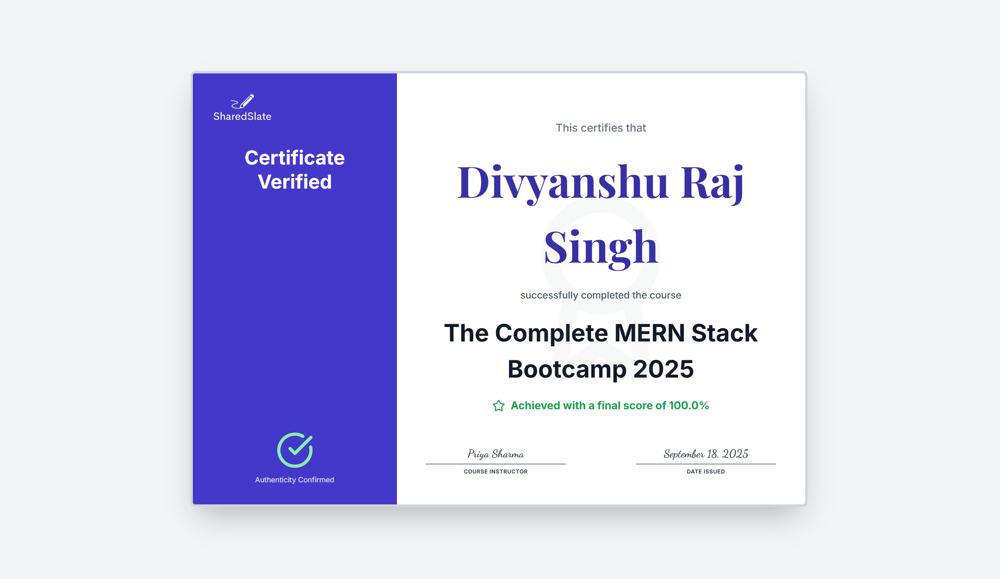

# SharedSlate E-Learning Platform

<p align="center">
  
</p>

<p align="center">
  <!-- Project Info -->
  <a href="https://course-marketplace-ten.vercel.app">
    
  </a>
  <a href="https://github.com/divyanshu02raj/course-marketplace">
    
  </a>
  <a href="https://github.com/divyanshu02raj/course-marketplace/stargazers">
    
  </a>
  <a href="https://github.com/divyanshu02raj/course-marketplace/network/members">
    
  </a>
</p>

<p align="center">
  <!-- Tech Stack -->
  
  
  
  
  
  
  
</p>

<p align="center">
  <!-- Deployment -->
  
  
</p>


<p align="center">
  A full-stack e-learning marketplace built on the MERN stack. SharedSlate is designed for instructors to create and sell courses and for students to learn, earn verifiable certificates, and interact in real-time.
</p>

---

## Table of Contents
- [Demo](#demo)
- [Key Features](#key-features)
- [Technology Stack](#technology-stack)
- [Getting Started](#getting-started)
- [Screenshots](#screenshots)
- [Future Work](#future-work)
- [Contributing](#contributing)
- [Acknowledgments](#acknowledgments)
- [Contact](#contact)

---

## Demo

* **Live Deployed Site:** [https://course-marketplace-ten.vercel.app/](https://course-marketplace-ten.vercel.app/)
* **Full Video Walkthrough:** [https://www.youtube.com/watch?v=XdwszILlerA](https://www.youtube.com/watch?v=XdwszILlerA)
* **GitHub Repository:** [https://github.com/divyanshu02raj/course-marketplace.git](https://github.com/divyanshu02raj/course-marketplace.git)

---

## Key Features

SharedSlate provides a complete, end-to-end learning lifecycle for both students and instructors, built with a modern and scalable architecture.

* **Dual User Roles:**
    * **Instructor Dashboard:** A dedicated view for instructors to create courses, manage lessons and media, build assessments, view earnings analytics, and communicate with students.
    * **Student Dashboard:** A personalized space for students to access enrolled courses, track progress, manage their notes, and view earned certificates.
* **Course Marketplace & Payments:**
    * Instructors can create, edit, and publish courses, setting their own pricing.
    * Students can browse a public catalog of courses and securely enroll using the **Razorpay** payment gateway.
* **Interactive Course Player:**
    * **Custom Video Player:** A sleek video player with custom controls for playback speed, skipping, and fullscreen mode.
    * **AI-Powered Summaries:** A "Get Key Takeaways" button utilizes the **Groq AI (LLaMA3)** API to generate concise, bulleted summaries of lesson text content.
    * **Personal Notes:** An integrated rich-text editor allows students to take and save personal notes for each lesson.
    * **Private Q&A:** Students can ask instructors questions directly within a lesson.
* **Gated Certification Flow:**
    * The final assessment for a course is **locked** until a student completes 100% of the lessons.
    * Upon successfully passing the final assessment, a unique, verifiable certificate is automatically generated and issued.
* **Secure Backend PDF Generation & Verification:**
    * Certificates are generated as text-selectable PDFs on the backend using **Puppeteer**, ensuring professional quality and preventing forgery.
    * Each certificate includes a unique ID and a **QR Code** that links to a public verification page, confirming its authenticity.
* **Real-Time Communication:**
    * A direct messaging system between students and instructors is built with **Socket.IO**, featuring real-time message delivery and live typing indicators.

---

## Technology Stack

The project utilizes a modern MERN stack with a decoupled frontend and backend architecture.

| Category | Technology |
| :--- | :--- |
| **Frontend** | `React`, `React Router`, `Tailwind CSS`, `Framer Motion`, `Recharts`, `Socket.IO Client`, `Axios` |
| **Backend** | `Node.js`, `Express.js`, `Socket.IO`, `JWT (JSON Web Tokens)` |
| **Database** | `MongoDB` with `Mongoose` |
| **Services** | `Cloudinary` (Media), `Razorpay` (Payments), `Groq` (AI), `Puppeteer` (PDFs) |
| **Deployment**| Frontend on **Vercel**, Backend on **Render** |

---

## Getting Started

To get a local copy up and running, please follow these steps.

### Prerequisites

* Node.js (v18 or newer recommended)
* npm (or yarn)
* A MongoDB database instance (local or a cloud service like MongoDB Atlas)

### Installation & Setup

1.  **Clone the Repository:**
    ```bash
    git clone https://github.com/divyanshu02raj/course-marketplace.git
    cd course-marketplace
    ```

2.  **Backend Setup:**
    * Navigate to the backend directory:
        ```bash
        cd course-marketplace-backend
        ```
    * Install dependencies:
        ```bash
        npm install
        ```
    * Create a `.env` file and populate it with your keys:
        ```env
        MONGO_URI=your_mongodb_connection_string
        JWT_SECRET=your_super_secret_jwt_key
        ALLOWED_ORIGINS=http://localhost:3000
        CLOUDINARY_URL=your_cloudinary_url_from_your_dashboard
        GOOGLE_CLIENT_ID=your_google_oauth_client_id
        RAZORPAY_KEY_ID=your_razorpay_key_id
        RAZORPAY_KEY_SECRET=your_razorpay_key_secret
        GROQ_API_KEY=your_groq_api_key
        ```
    * Start the backend server:
        ```bash
        npm start
        ```

3.  **Frontend Setup:**
    * Open a new terminal and navigate to the frontend directory:
        ```bash
        cd course-marketplace-frontend
        ```
    * Install dependencies:
        ```bash
        npm install
        ```
    * Create a `.env` file and add the following variables:
        ```env
        REACT_APP_API_BASE_URL=http://localhost:5000
        REACT_APP_GOOGLE_CLIENT_ID=your_google_oauth_client_id_again
        REACT_APP_RAZORPAY_KEY_ID=your_razorpay_key_id_again
        ```
    * Start the frontend development server:
        ```bash
        npm start
        ```

---

## Screenshots

<table>
  <tr>
    <td align="center" width="50%">
      <b>Landing Page</b><br>
      <i>The public-facing marketing page for the platform.</i><br><br>
      
    </td>
    <td align="center" width="50%">
      <b>Instructor Dashboard</b><br>
      <i>The data-rich hub for instructors, showing stats and recent activity.</i><br><br>
      
    </td>
  </tr>
  
  <tr>
    <td align="center">
      <b>Course Catalog (Student View)</b><br>
      <i>The public catalog where students can browse, search, and filter available courses.</i><br><br>
      
    </td>
    <td align="center">
      <b>Course Details (Pre-Enrollment)</b><br>
      <i>The detailed "sales page" for a single course before a student enrolls.</i><br><br>
      
    </td>
  </tr>

  <tr>
    <td align="center">
      <b>My Courses (Instructor View)</b><br>
      <i>The instructor's view to manage all their created courses (draft & published).</i><br><br>
      
    </td>
    <td align="center">
      <b>The Course Player (Student View)</b><br>
      <i>The core learning environment with video, notes, Q&A, and AI summaries.</i><br><br>
      
    </td>
  </tr>

  <tr>
    <td align="center">
      <b>Student Dashboard</b><br>
      <i>The student's main hub, showing their enrolled courses, progress, and certificates.</i><br><br>
      
    </td>
    <td align="center">
      <b>Razorpay Payment Gateway</b><br>
      <i>The secure, integrated payment modal for course enrollment.</i><br><br>
      
    </td>
  </tr>

  <tr>
    <td align="center">
      <b>The Final Certificate</b><br>
      <i>The student's view of their professionally designed, downloadable certificate.</i><br><br>
      
    </td>
    <td align="center">
      <b>Public Certificate Verification</b><br>
      <i>The public-facing authenticity page accessed via the certificate's QR code.</i><br><br>
      
    </td>
  </tr>

  <tr>
    <td align="center">
      <b>Lesson Manager (Instructor View)</b><br>
      <i>The interface for instructors to add, edit, and manage their course curriculum.</i><br><br>
      
    </td>
    <td align="center">
      <b>Earnings Overview (Instructor View)</b><br>
      <i>The dedicated page for instructors to track their revenue and transactions.</i><br><br>
      
    </td>
  </tr>

  <tr>
    <td align="center">
      <b>Real-Time Chat (Student View)</b><br>
      <i>A student sending a message to their instructor.</i><br><br>
      
    </td>
    <td align="center">
      <b>Real-Time Chat (Instructor View)</b><br>
      <i>The instructor receiving the message and replying in real-time.</i><br><br>
      
    </td>
  </tr>
</table>


---


## Future Work

While the core functionality is complete, there are several exciting features that could be added to enhance the platform:

* **Advanced Instructor Analytics:** Implement more detailed reports on student engagement, assessment performance, and video heatmaps.
* **Promotional Tools:** Allow instructors to create discount codes or bundle courses to boost sales.
* **Community Features:** Introduce course-specific discussion forums to foster a learning community.
* **Admin Dashboard:** Build a super-admin panel for user management, platform oversight, and global analytics.

---

## Contributing

Contributions are what make the open-source community such an amazing place to learn, inspire, and create. Any contributions you make are **greatly appreciated**.

1.  Fork the Project
2.  Create your Feature Branch (`git checkout -b feature/AmazingFeature`)
3.  Commit your Changes (`git commit -m 'Add some AmazingFeature'`)
4.  Push to the Branch (`git push origin feature/AmazingFeature`)
5.  Open a Pull Request

---

## Acknowledgments

This project stands on the shoulders of giants. Special thanks to the teams and communities behind:

* React & the MERN Stack
* Socket.IO for real-time communication
* Puppeteer for browser automation
* Tailwind CSS for beautiful styling
* All the other open-source libraries listed in `package.json`

---

## Contact

Divyanshu Raj

* **LinkedIn:** [https://www.linkedin.com/in/div02raj](https://www.linkedin.com/in/div02raj)
* **GitHub:** [https://github.com/divyanshu02raj](https://github.com/divyanshu02raj)
